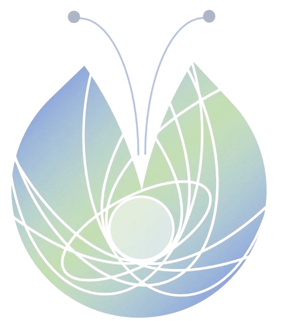

 


# cocoon
**co**upled **co**mmunication simulation with an **on**line trained meta-model

## Overview
cocoon (**co**upled **co**mmunication simulation with an **o**nline trained meta-model) is a novel approach to 
approximating communication simulations in Cyber-Physical Energy Systems (CPES). 
This approach addresses the computational challenges of simulating communication networks in CPES by introducing an 
online meta-modeling approach that progressively adapts to specific communication patterns during simulation execution.

## Key Features

- **Graph-based network representation** that captures essential topological and state information without requiring explicit network topology inputs
- **Four-phase adaptive learning methodology** (EGG, LARVA, PUPA, BUTTERFLY) for progressively improving prediction accuracy
- **Online integration capabilities** with energy system simulations
- **Dynamic adaptation** to different communication scenarios
- **Computational efficiency** without sacrificing accuracy

## Methodology

Our approach follows a four-phase process inspired by the metamorphosis of a butterfly:

### 1. EGG Phase 
- Establishes foundation for prediction through cluster analysis and pre-training
- Analyzes historical message data to identify distinct patterns
- Uses hierarchical clustering with optimized decision tree regressors
- [egg.py](src/training/egg.py)

### 2. LARVA Phase
- Marks the beginning of simulation scenario execution
- Addresses initialization bias by gathering sufficient data
- Assigns new messages to the closest historical cluster
- - [larva.py](src/training/larva.py)

### 3. PUPA Phase
- Trains an additional regressor online on current scenario data
- Combines cluster-based and online predictions through a weighting mechanism
- Progressively improves prediction accuracy as the scenario unfolds
- [pupa.py](src/training/pupa.py)

### 4. BUTTERFLY Phase
- Activated when weighted predictions consistently meet a predefined accuracy threshold
- Replaces the original communication simulation entirely
- Continues to process messages using the weighted prediction approach

## Usage
Users can run the time advancement example ([example](tests/integration_tests/test_time_advancement.py)) 
provided in the repository.

## Installation

```bash
git clone https://github.com/OFFIS-DAI/cocoon.git
cd cocoon
pip install -r requirements.txt
```

## License

This project is licensed under the MIT License - see the LICENSE file for details.

## Contact

- Malin Radtke - malin.radtke@offis.de