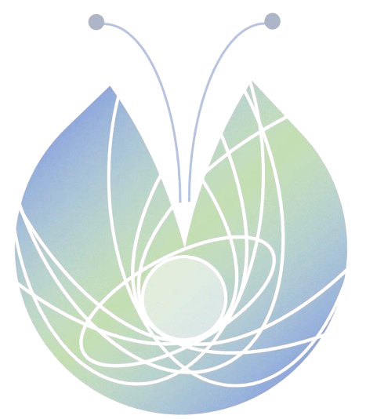

# COCOON

**Co**upled **Co**mmunication Simulation with an **O**nline Trained Meta-Model

[](https://opensource.org/licenses/MIT)
[](https://www.python.org/downloads/)

## Overview

COCOON is a novel approach to approximating communication simulations in Cyber-Physical Energy Systems (CPES). This approach addresses the computational challenges of simulating communication networks in CPES by introducing an online meta-modeling approach that progressively adapts to specific communication patterns during simulation execution.

The meta-model learns to predict message delays during runtime and can eventually substitute the detailed OMNeT++ simulation, significantly reducing computational overhead while maintaining prediction accuracy.

## Key Features

- **Graph-based network representation** that captures essential topological and state information without requiring explicit network topology inputs
- **Four-phase adaptive learning methodology** (EGG, LARVA, PUPA, BUTTERFLY) for progressively improving prediction accuracy
- **Online integration capabilities** with energy system simulations via the [mango-agents](https://mango-agents.2112.1.2.3) framework
- **Dynamic adaptation** to different communication scenarios
- **Computational efficiency** without sacrificing accuracy
- **Support for multiple ML models**: Decision Trees and Random Forests

## Methodology

Our approach follows a four-phase process inspired by the metamorphosis of a butterfly:

### 1. EGG Phase
- Establishes foundation for prediction through cluster analysis and pre-training
- Analyzes historical message data to identify distinct communication patterns
- Uses hierarchical clustering with optimized decision tree/random forest regressors
- Implementation: [`CocoonMetaModel.execute_egg_phase()`](integration_environment/network_models/cocoon_meta_model.py)

### 2. LARVA Phase
- Marks the beginning of simulation scenario execution
- Addresses initialization bias by gathering sufficient data
- Assigns new messages to the closest historical cluster using centroid optimization
- Implementation: [`CocoonMetaModel.execute_larva_phase()`](integration_environment/network_models/cocoon_meta_model.py)

### 3. PUPA Phase
- Trains an additional regressor online on current scenario data
- Combines cluster-based and online predictions through an EWMA weighting mechanism
- Progressively improves prediction accuracy as the scenario unfolds
- Implementation: [`CocoonMetaModel.execute_pupa_phase()`](integration_environment/network_models/cocoon_meta_model.py)

### 4. BUTTERFLY Phase
- Activated when weighted predictions consistently meet a predefined accuracy threshold
- Replaces the original communication simulation entirely
- Continues to process messages using the weighted prediction approach
- Implementation: [`CocoonMetaModel.execute_butterfly_phase()`](integration_environment/network_models/cocoon_meta_model.py)

## Project Structure

```
cocoon/
├── integration_environment/          # Main Python simulation framework
│   ├── network_models/              # Network model implementations
│   │   ├── cocoon_meta_model.py     # Core COCOON meta-model
│   │   ├── detailed_network_model.py # OMNeT++ integration
│   │   ├── channel_network_model.py  # NetworkX-based channel model
│   │   └── static_graph_model.py     # Static delay graph model
│   ├── communication_model_scheduler.py  # Scheduler implementations
│   ├── roles.py                     # MANGO agent roles
│   └── model_comparison/            # Experimental evaluation suite
├── cocoon_omnet_project/            # OMNeT++ C++ integration
│   ├── MangoScheduler.cc/h          # Custom OMNeT++ scheduler
│   ├── MangoTcpApp.cc/h             # TCP application module
│   └── networks/                    # Network topology definitions
├── stand_alone/                     # Standalone meta-model usage
├── tests/                           # Test suite
│   ├── integration_tests/           # Integration tests
│   └── unit_tests/                  # Unit tests
└── docs/                            # Documentation
```

## Installation

### Prerequisites

- Python 3.10 or higher
- OMNeT++ 6.x (for detailed simulation)
- INET Framework 4.x
- (Optional) Simu5G for 5G network simulations

### Python Dependencies

```bash
git clone https://github.com/OFFIS-DAI/cocoon.git
cd cocoon
pip install -r requirements.txt
```

### OMNeT++ Setup

1. Install OMNeT++ following the [official installation guide](https://omnetpp.org/download/)
2. Install the INET Framework
3. Build the COCOON OMNeT++ project:

```bash
cd cocoon_omnet_project
make MODE=release all
```

### Environment Configuration

Set the following environment variables or update the paths in your configuration:

```bash
export INET_INSTALLATION_PATH=/path/to/inet
export OMNET_PROJECT_PATH=/path/to/cocoon/cocoon_omnet_project
```

## Usage

### Standalone Meta-Model Usage

For using the meta-model without the full MANGO agent framework or OMNeT++:

```python
import pandas as pd
from integration_environment.network_models.cocoon_meta_model import CocoonMetaModel

# Load training data (historical message observations with delays)
training_df = pd.read_csv('path/to/training_data.csv')

# Initialize the meta-model in production mode
meta_model = CocoonMetaModel(
    output_file_name='results.csv',
    mode=CocoonMetaModel.Mode.PRODUCTION,
    cluster_distance_threshold=5.0,
    i_pupa=50,
    alpha=0.3,
    butterfly_threshold_value=0.8
)

# Execute EGG phase (pre-training with historical data)
meta_model.execute_egg_phase(training_df)

# Process messages during simulation
# See stand_alone/stand_alone_meta_model.py for a complete example
```

### Running a Scenario

Run a single scenario with configurable parameters:

```bash
cd integration_environment/model_comparison
python run_scenario.py
```

### Model Comparison Experiments

Run the full experimental evaluation suite:

```bash
cd integration_environment/model_comparison
python execute_comparison.py
```

## Configuration

The meta-model supports various configuration parameters:

| Parameter | Description | Default |
|-----------|-------------|---------|
| `cluster_distance_threshold` | Threshold for hierarchical clustering | 5.0 |
| `i_pupa` | Batch size for PUPA phase training | 10 |
| `alpha` | EWMA smoothing parameter | 0.3 |
| `butterfly_threshold_value` | Accuracy threshold for substitution | 0.8 |
| `use_random_forest` | Use Random Forest instead of Decision Tree | False |

## Testing

> **Note**: Integration tests require OMNeT++ and INET Framework to be installed and configured.
> Unit tests can be run without these dependencies.

```bash
# Run unit tests (no OMNeT++ required)
pytest tests/unit_tests/ -v
```

## Citation

If you use COCOON in your research, please cite:

```bibtex
@misc{cocoon2025,
  author = {Radtke, Malin},
  title = {COCOON: Coupled Communication Simulation with an Online Trained Meta-Model},
  year = {2025},
  publisher = {GitHub},
  url = {https://github.com/OFFIS-DAI/cocoon}
}
```

## License

This project is licensed under the MIT License - see the [LICENSE](LICENSE) file for details.

## Acknowledgments

This work was developed at [OFFIS - Institute for Information Technology](https://www.offis.de/) as part of dissertation research on accelerating communication simulation in cyber-physical energy systems.

## Contact

- **Malin Radtke** - [malin.radtke@offis.de](mailto:malin.radtke@offis.de)